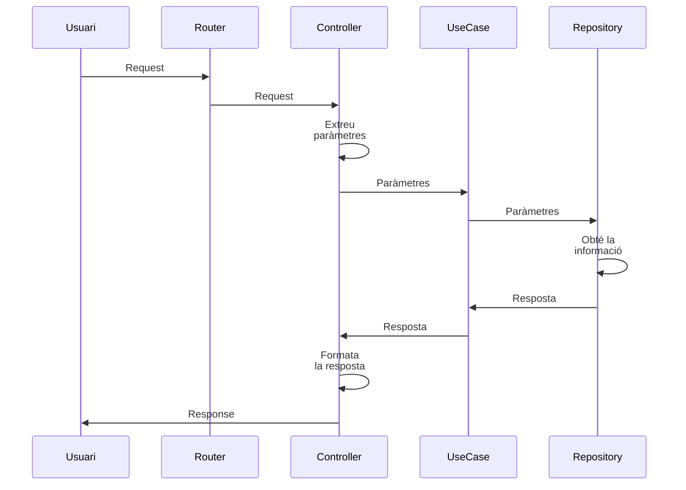
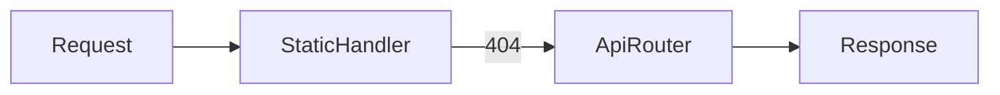

# Creació d'una API amb Shelf i Clean Architecture

Anem a veure arquitectura completa d'un servidor desenvolupant amb *Shelf*, que ofereix una API REST per servir la carta d'una app de menjar ràpid, però saludale.

Tots els endpoints de l'API estan agrupats sota el prefix /api:

| Endpoint                    | Descripció                                                                         |
| --------------------------- | ---------------------------------------------------------------------------------- |
| GET /api/health             | Retorna `ok` com a resposta quan el servidor és en funcionament                    |
| GET /api/entrants           | Retorna tots els entrants de la carta                                              |
| GET /api/entrants/<tipus>   | Retorna tots els entrants de la carta filtrats pel tipus (amanides, tartars...)    |
| GET /api/principals         | Retorna tots els plats principals de la carta                                      |
| GET /api/principals/<tipus> | Retorna tots els plats ptincipals de la carta filtrats pel tipus (pokes, wraps...) |
| GET /api/begudes            | Retorna totes les begudes de la carta                                              |
| GET /api/begudes/<tipus>    | Retorna totes les begudes de la carta filtrades pel tipus (kombuches, aigues...)   |

Tot i tractar-se d'un cas concret, l'estructura del projecte pot servir com a model per a altres backend en Dart.

## 1. Visió general de l'arquitectura

L'arquitectura de l'aplicació es basa en dos idees principals: els principis de l'arquitectura Clean i la llibreria Shelf:

* Amb **Clean Architecture** estructurem tota l'aplicació en capes independents, assegurant la separació de responsabilitats i garantint els principis SOLID de disseny de programari. En essència, aquesta capa defineix:

   * Una capa de **Domini**, que inclou les **Entitats**, els **Casos d'ús** i defineix els **Repositoris abstractes**,
   * Una capa d'**infrastructura**, encarregada de l'accés als recursos i les dades, mitjançant la implementació dels **Repositoris Concrets**,
   * Una capa de **presentació** de dades, que és qui *interactúa* amb l'usuari i li presenta les dades. Generalment, aquesta serà la interfície d'usuari, però en una aplicació de servidor com aquesta, contempla tota la part de gestió de peticions i generació de respostes (HTTP).
  

* **Shelf**, la llibreria de Dart que utilitzarem, que serà qui s'encarregarà de la gestió mínima d'HTTP. És a dir, s'usarà principalment a la capa de presentació de CLEAN, i aci definim:

   * **handlers** o **manipuladors**, per gestionar peticions i generar respostes. Quan gestionem la lògica de l'aplicació amb **Controllers**, farem ús d'ells per organitzar aquesta.
   * **middlewares**, per realitzar accions davant les peticions (autenticació, logging...)
   * **routers**, per encaminar les peticions a uns o altres manipuladors,
   * **pipelines** i **cascades**, per definir cadenes de processament de manipuladors, middlewares i routers.

> Observem que Shlf **no defineix l'arquitectura de l'aplicació**. Aquesta arquitectura la defineix CLEAN, mentreque Shelf només proporciona mecanismes per rebre i respondre peticions.

## 2. Estructura de carpetes

L'estructura de carpetes del servidor és la següent:

```
.
├── bin
│   └── main.dart                                 // Inici de l'aplicació. Arranca el servidor.
└── lib
    ├── server.dart                               // Fitxer principal d'orquestació del servidor.
    ├── domain                                    // Capa de domini
    │   ├── entities                              // -> Entitats (Beguda, Entrant i Principal)
    │   │   ├── beguda.dart
    │   │   ├── entrant.dart
    │   │   └── principal.dart
    │   ├── repository                            // -> Definició abstracta del repositori
    │   │   └── carta_repository.dart
    │   └── usecase                               // -> Casos d'ús, per entitat
    │       ├── begudes
    │       │   ├── begudes_usecases.dart
    │       │   └── get_begudes_usecase.dart
    │       ├── entrants
    │       │   ├── entrants_usecases.dart
    │       │   └── get_entrants_usecase.dart
    │       └── principals
    │           ├── get_principals_usecase.dart
    │           └── principals_usecases.dart
    ├── http                                      // Capa de presentació
    │   ├── controllers                           // -> Controladors, gestionats amb handlers
    │   │   ├── begudes_controller.dart
    │   │   ├── entrants_controller.dart
    │   │   └── principals_controller.dart
    │   ├── middlewares                           // -> Middlewares
    │   ├── routes                                // Rutes
    │   │   ├── api_router.dart
    │   │   ├── begudes_router.dart
    │   │   ├── entrants_router.dart
    │   │   └── principals_router.dart
    └── infrastructure                          // Capa d'infrastructura (d'Accés a dades, entre altres)
        ├── di.dart                             // Contenidor d'injecció de dependències
        └── inMemory                            // Implementació de l'accés a dades "en memòria", definides directament com a variables
            ├── data                            // Dades
            │   └── inmemory.dart
            ├── data_sources                    // Accés a les dades
            │   └── in_memory_datasource.dart
            ├── mappers                         // Mapejadors de la represenació de dade al domini
            │   ├── beguda_mapper.dart
            │   ├── entrant_mapper.dart
            │   └── principal_mapper.dart
            └── repositories                    // Implementació concreta dels repositoris per a aquesta representació de les dades
                └── in_memory_repository.dart

```

Veiem, en forma de taula les diferents responsabilitats de cada carpeta:

| Carpeta           | Responsabilitat                                   |
| ----------------- | ------------------------------------------------- |
| `domain/`         | Defineix entitats, repositoris abstractes i casos d'ús que implementen les regles de negoci pures, independents de Shelf     |
| `infrastructure/` | Implementacions concretes dels repositoris per accedir als recursos (InMemory, Mongo, etc.) |
| `http/`           | Adaptació HTTP (Shelf): routers, controllers, i si cal middlewares    |
| `server.dart`     | **Composition Root** (injecció de dependències)   |
| `bin/main.dart`   | Punt d'entrada del programa                       |

Veim-ho tot per parts.

## 3. Clean Architecture (independent de Shelf)

### 3.1 Domini

Com hem dit, la capa de domini defineix entitats, repositoris abstractes i casos d'ús que implementen les regles de negoci pures, independents de Shelf.

Aquesta capa, per tant **no coneix Shelf** ni res d'HTTP.

Em ella hem definit:

* **Entitats** (`Entrant`, `Principal`, `Beguda`)
* **Repositoris abstractes** (`CartaRepository`)
* **Casos d'ús** (un per operació: ObtenirEntrants, ObtenirPrincipals i ObtenirBegudes). Aquests casos d'ús treballen amb les entitats del domini i amb els **Repositoris Abstractes/Interfícies**. Això és important per contemplar el principi **D**IP/*Inversió de Dependències* dels [principis SOLID](https://es.wikipedia.org/wiki/SOLID): *Dependre d'abstraccions, no d'implementacions*.

### 3.2 Casos d'ús (useCases) agrupats per característiques/feature (bundles)

Per evitar constructors inestables i facilitar el creixement cap a CRUD, els casos d'ús s'agrupen per característiques o *features*:

```
domain/usecases/entrants/
├── get_entrants_usecase.dart
└── entrants_usecases.dart
```

El *bundle* és una classe que *empaqueta" els diferents casos d'ús, però **no conté cap lògica**. En aquest cas, el *Bundle* és la classe *EntrantsUsecases*, que agrupa el cas d'ús `getEntrantsUsecase` per obtenir els entrants, però també tindria cabuda per a posteriors casos d'ús que faciliten un CRUD complet (*addEntrantsUseCase*, *deleteEntrantsUseCase*, *updateDeleteUseCase*, etc...)

Aquesta organització mitjançant el Bundle ens permet:

* afegir nous casos d'ús sense modificar els controllers
* mantindre dependències clares i explícites

## 4. Components de Shelf (capa HTTP)

### 4.1 Controllers ≠ Use cases

Els **controllers** són adaptadors HTTP. Els diem controladors per mantindre la nomenclatura tradicional de serveis HTTP, encara que en Shelf es corresponen als *Handlers*.

Aquests controladors/Handlers:

* reben una petició (objecte de tipus `Request`)
* extrauen paràmetres (ruta, query, body)
* Invoquen un cas d'ús
* retornen una resposta (objecte de tipus `Response`)

> [IMPORTANT] **Important**
> És important tenir en compte que un Controller no implementa la lògica de negoci, d'això s'encarreguen els casos d'us.

Veiem el diagrama de seqüència corresponent:



### 4.2 Routers

Shelf no té enrutament propi,com a tal, però tenim la llibreria `shelf_router` que s'encarrega de l'enrutament.

La tasca principal dels routers és la d'associar rutes als *handlers* (controllers), però NO crea els controladors ni fa *Injecció de Dependències*.

> [NOTE] **Injecció de dependències**
>
La **injecció de dependències** consisteix a passar a una classe els objectes que necessita per funcionar, en lloc de crear-los ella mateixa.
>
> Això permet separar responsabilitats, facilitar el manteniment del codi i substituir fàcilment unes implementacions per altres (per exemple, passar d'una representació de les dades *en Memòria* a una representació en una base de dades sense modificar la resta de l'aplicació).
>
> En aquest projecte, els routers no creen ni coneixen les dependències de l'aplicació (repositoris, casos d'ús, etc.).
>
> La injecció de dependències es fa en un únic punt, anomenat *composition root* (server.dart), on es construeixen els controladors amb totes les dependències necessàries.
>
> D'questa manera:
> 
> * els routers només s'encarreguen de definir rutes,
> * els controladors només gestionen peticions HTTP,
> * i la lògica de creació i configuració de l'aplicació queda centralitzada i desacoblada.
>

Veiem-ho amb un exemple on definim el router per als plats principals. En aquest cas, associem dues rutes: `/` i `/<tipus>` (aquestes estan dins la ruta `/api/principals`), per obtindre els principals, ja siguen sense o amb filtre per tipus:

```dart
Router buildPrincipalsRoutes(PrincipalsController controller) {
  return Router()
    ..get('/', controller.getPrincipals)
    ..get('/<tipus>', controller.gePrincipalstByTipus);
}
```

COm veiem, el que fem és associar a cada ruta un Controlador, **el qual gem rebut com a argument, no el definim aci**.

> [NOTE] **Sobre l'operador `..` (cascade)**
>
> L'operador `..` permet encadenar crides sobre el mateix objecte. Per exemple:
>
> ```dart
> final r = Router()
>   ..get(...)
>   ..post(...);
> ```
> 
> Que seria l'equivalent a:
>
> ```dart
> final r = Router();
> r.get(...);
> r.post(...);
> ```
> El resultat és el mateix, però amb `..` fem la composició d'objectes  de forma declarativa.
>

#### El Router Principal

El Router anterior s'encarrega només de les rutes relacionades amb els principals. Per composar les diferents rutes i definir el router principal, ho fem des del fitxer `api_router.dart`, que ens defineix la funció `buildApiRouter` per retornar-nos aquest router principal:

```dart
Router buildApiRouter(
  EntrantsController ec,
  PrincipalsController pc,
  BegudesController bc,
) {
  final api = Router()
    ..mount('/api/entrants', buildEntrantsRoutes(ec).call)
    ..mount('/api/begudes', buildBegudesRoutes(bc).call)
    ..mount('/api/principals', buildPrincipalsRoutes(pc).call);
  return api;
}
```

> [NOTE] **`..mount`**
>
> Amb `..mount` el que fem és *muntar* rutes sobre un únic router. En aquest cas, el que estem fent és *muntar* el router principal amb les rutes `/api/entrants`, `/api/begudes`, i `/api/principals`, i enllaçar-los amb els routers corresponents (`buildEntrantsRoutes`, `buildBegudesRoutes` i `buildPrincipalsRoutes`). Dins aquestes rutes principals, ja establim les subrutes de cada *miniaplicació*.
>
> Observeu que aquesta funció rep els tres controladors principals, i per tant, no els ha de construir ella mateixa (injecció de dependències!)
>

> [NOTE] **El `.call`**
>
> En Shelf, les rutes esperen un *handler*, és a dir, una funció que rep una petició i retorna una resposta.
>
> Per altra banda, un *Router* és un objecte, una instància de la classe `Router` definida en la llibreria *shelf_router*.
> 
> Aci és on entra en joc la funció *call*, un mecanisme que s'usa en *Dart* per indicar que un objecte es tracte com una funció. Com? Doncs simplement, la classe (en aquest cas *Router*) implementa un el mètode especial `call` i ja es pot utilitzar com a funció.
>
> Per tant, quan escrivim:
>
> `buildPrincipalsRoutes(controller).call`
>
>
> estem passant al framework la funció interna del router que s'encarrega de gestionar les peticions. Aquest pas és necessari perquè *Shelf* treballa amb funcions (handlers), no directament amb objectes Router.
>


## 5. Cascade i Pipeline

### 5.1 Pipeline

Un **Pipeline** és una classe (*hepler*) que faclilita la composició d'una cadena de *middlewares* i un handler final.

Per exemple, una pipeline que defineix un middleware per a logging i altre per a autenticació i acaba amb un handler es definiria així:

```dart
Pipeline()
  .addMiddleware(logRequests())
  .addMiddleware(authentication())
  .addHandler(handler);
```

### 5.2 Cascade

Un **Cascade** prova diversos handlers **en ordre** fins que un respon.

Per exemple, el següent defineix un gestor de recursos estàtics (*staticHandler*) i el router principal:

```dart
final rootHandler = Cascade()
  .add(staticHandler)
  .add(apiRoutes)
  .handler;
```

Flux:



Amb això, primer es mira si existeixen el recurs en els fitxers estàtics, i si no existeixen, passar a l'API.

## 6. Composition Root (server.dart)

`server.dart` actúa com *director d'orquestra* dels diferents components de l'aplicació. És en aquest Composition Root on:

* Es coneixen implementacions concretes
* S'injecten dependències
* Es construeixen controllers

Amb això aconseguim que cap *router* ni *controller* accedisquen directament a la injecció de dependències, evitant patrons no desitjables i facilitant el testeig de les aplicacions.