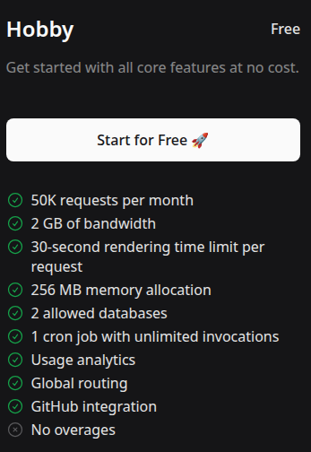
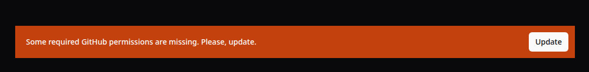
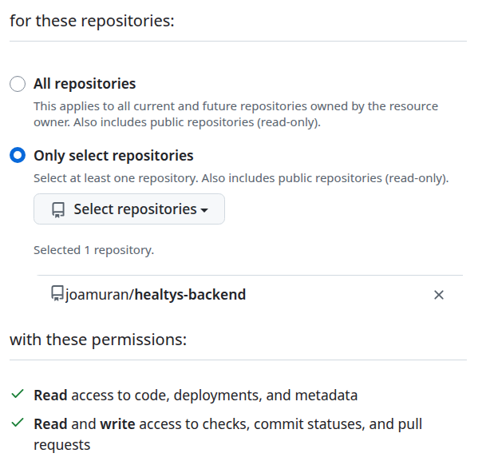
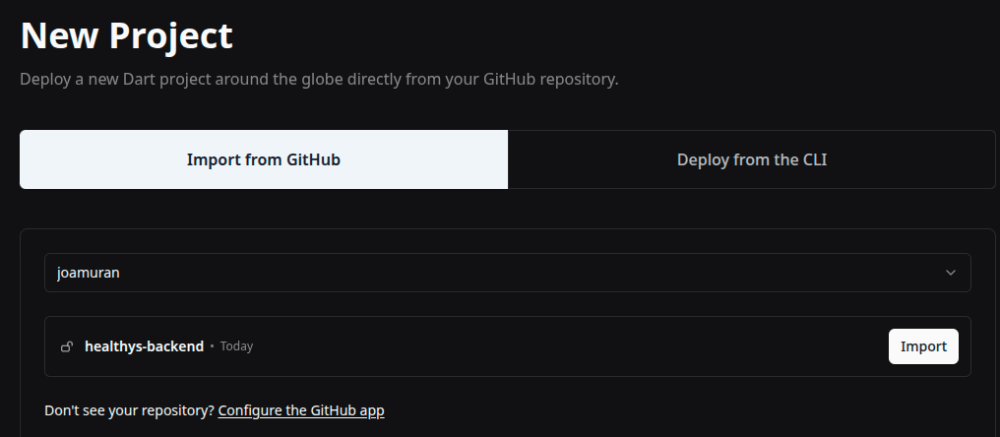
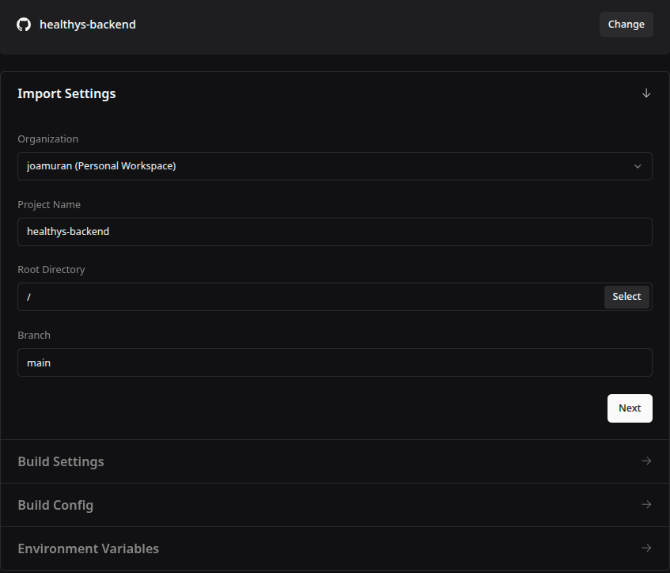
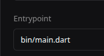

# Desplegament de l'API a Globe.dev

[Globe.dev](https://globe.dev/)

Globe.dev és una plataforma de desplegament especialitzada en aplicacions Dart i Flutter, i compta amb [diversos plans](https://globe.dev/pricing/) segons les nostres necessitats, des de comptes *Hoby* gratuits fins solucions més empresarials.

En el pla *hoby* tindrem suficient per treballar amb projectes personals. Les seues principals caracterśtiques són:

* 50.000 peticions per mes
* 2 GB d'ample de banda
* Limit de 30 segons per petició
* 256 MB de RAM
* 2 bases de dades
* 1 treball de *cron* amb il·limitades invocacions
* Estadístiques d'ús
* Enrutament global
* Integració amb github



## Preparant el projecte

***Estructura de carpetes**

Per tal de poder desplegar els nostres projectes a Globe, aquests han de tindre una estructura ben definida:

```
projecte/
├── bin/
│   └── main.dart (punt d'entrada)
├── lib/
├── pubspec.yaml
└── .gitignore
```

El fitxer d'entrada al projecte es podrà indicar en el moment de configurar el projecte a Globe.

**Configuració del port i el host**

Globe.dev assigna dinàmicament un port a través de la variable d'entorn PORT. Per tant, haurem de preparar el nostre projecte perquè l'agafe. El fitxer `bin/main.dart` serà doncs:

```dart
import 'dart:io';

import 'package:healthys_backend/server.dart';

void main(List<String> args) {
  // Si existeix, agafem el port proporcionat per l'Environment
  // Si despleguem a Globe.dev ens el proporciona
  final port = int.parse(Platform.environment['PORT'] ?? '8080');
  startServer(port);
}
```

Així ens assegurem d'agafar el port que ens proporciona Globe a través de les variables d'entorn, i si no existeix, definim el 8080 (per a desplegaments en local)

**Fitxer de configuració globe.yaml**

A l'arrel del projecte creem un nou fitxer `globe.yaml` amb el següent contingut:

```yaml
name: nom-projecte-api
runtime: dart
entrypoint: bin/main.dart

# Versió de Dart (opcional)
dart:
  version: stable

# Opcional: variables d'entorn
#env:
#  - KEY: value

```

**Actualització del .gitignore**

Finalment, ens assegurem que el `.gitignore` continga:

```gitignore
# https://dart.dev/guides/libraries/private-files
# Created by `dart pub`
.dart_tool/

# Afegides a banda per a globe.dev
.packages
build/
pubspec.lock  # opcional, però recomanat per backends
```

## Configuració a Globe.dev

Abans que res, haurem de tindre un compte en [Globe.dev](https://globe.dev/). Ens podem registrar amb el nostre compte de GitHub, GitLab o email
Verifica el teu compte si cal. Si ens registrem amb Github ja podem connectar el nostre compte de Globe.dev al de Github. Per a això haurem de donar accés a Globe al nostre repositori:





**Creació d'un projecte**

Per creer un projecte, des del *Dashboard* de Globe.dev, farem clic en el botó *New Project* i l'importarem des de *Github*.



Des d'aci seleccionarem el repositori a Github del projecte i configurarem alguns aspectes, com el punt d'entrada:





# Altres opcions de desplegament i documentació

* [4 Ways to Deploy Your Dart Backend](https://globe.dev/blog/4-ways-deploy-dart-backend/)

* [Deploying Dart Backend Apps on Docker: Step-by-Step Guide](https://dartcodelabs.com/deploying-dart-backend-apps-on-docker-step-by-step-guide/#deploying-the-dockerized-dart-backend
)


